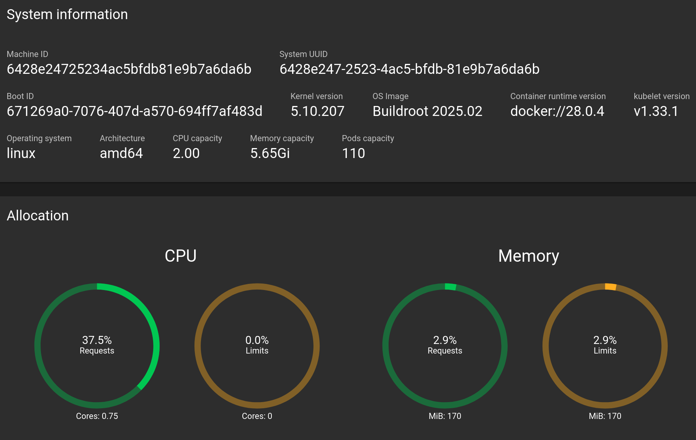

<style>

section {
  background: white;
  color: black
}
h1 {color: teal}

.centered-image {
    display: block;
    margin-left: auto;
    margin-right: auto;
}

</style>

# Deploying a Web Application with Kubernetes
## A Cloud Native SIG Workshop
### RSECon25 Thursday 11th September
Authors: Laura Shemilt <sup>1</sup> , Lewis Sampson <sup>2</sup> , Piper Fowler-Wright<sup>1</sup> and Alex Lubbock<sup>1</sup>

<sup>1</sup> *The Rosalind Franklin Institute*
<sup>2</sup> *Science and Techonology Facilities Council, Scientific Computing Division - DAFNI*


---
# Why Kubernetes?

Kubernetes is a powerful container orchestration platform that automates deployment, scaling, and management of containerized applications. Kubernetes offers a range of others benefits including:

- Self-Healing and Reliability
- Declarative Configuration and Rolling Updates
- Management of compute resouces, networking, and security.
- Stateful Applications
- Backups and Restoration
---
# Kubernetes Architecture
The Kubernetes architecture is divided into two main parts:

- Control Plane
- Worker Nodes
---

# Kubernetes Architecture - Control Plane
<!--
The **Control Plane** is the brain of the Kubernetes cluster. It manages the cluster's state and makes decisions about scheduling, scaling, and responding to events. The Control Plane has individual components running as pods on the node, each responsible for various tasks.
-->

Key Components:
- API Server - Acts as the front-end for the Kubernetes control plane. All interactions go through this RESTful API.

- Controller Manager - Runs `controllers` that handle routine tasks like node health checks, replication, and endpoint management.

- Scheduler - Assigns newly created pods to nodes based on resource availability and constraints.

- etcd - A distributed key-value store that holds all cluster data.

---

# Kubernetes Architecture - Worker Nodes
Worker nodes are where your application containers actually run. Each node has the following components:

- Kubelet - An agent that runs on each node. It communicates with the API server and ensures containers are running as expected.

- Container Runtime - Software responsible for running containers (e.g., Docker, containerd).

- Kube-proxy - Handles network routing and load balancing for services within the cluster.

---

## Kubernetes resources

### Containers: The Building Blocks

A container is a lightweight, standalone, executable package that includes everything needed to run a piece of software: code, runtime, libraries, and system tools.

Why Containers?

- **Portability**: Runs the same across environments.
- **Isolation**: Each container runs independently.
- **Efficiency**: Uses fewer resources than virtual machines.

---

### Pods: The Smallest Deployable Unit in Kubernetes

A pod is a group of one or more containers that share storage, network, and a specification for how to run the containers.

**Key Characteristics**:

- Containers in a pod share the same IP address and port space.
- Pods are ephemeral—if a pod dies, Kubernetes can replace it.
- Typically, a pod contains a single container, but can include sidecars (e.g., logging or proxy containers).

**Analogy**: Think of a pod as a wrapper around containers that Kubernetes can manage.

---

### Deployments: Managing Application Lifecycle

A deployment is a Kubernetes object that manages a set of pods and ensures the desired number of replicas are running at all times.

**Features**:

- **Declarative updates**: You define the desired state, and Kubernetes makes it happen.
- **Rollouts and rollbacks**: Easily update your application or revert to a previous version.

---

## Minikube

During this workshop we will be demonstrating Kubernetes using Minikube to create clusters and deploy resources. Minikube is a tool that lets you run a single-node Kubernetes cluster locally on your machine.

It’s designed for developers and learners who want to experiment with Kubernetes without needing a full multi-node setup.

Key Differences:
- **Single-node setup**: Control plane and worker node are co-located.
- **Simplified networking**: Easier to manage locally.
- **Ideal for testing**: Lightweight and fast to spin up.

---

### How standard Kubernetes architecture maps to Minikube:

| Standard Kubernetes | Minikube  |
|---------------------|---------------------|
| Control Plane       | Runs inside the Minikube VM/container |
| Worker Node         | Same VM/container acts as the worker node |
| Kubelet             | Runs inside Minikube |
| API Server          | Accessible via `kubectl` on your host |
| etcd, Scheduler, Controller Manager | All run inside the Minikube VM |

Minikube supports many standard Kubernetes features as well as third-party extensions in the form of [addons](https://minikube.sigs.k8s.io/docs/handbook/deploying/#addons).

---
# Lesson 0: Minikube Dashboard

In this lesson we will create a cluster, if you have not already, and deploy the Kubernetes dashboard with minikube.

---
# Lesson 0: Minikube Dashboard
With minikube installed starting a cluster is easy :
```bash
minikube start
```
Minikube also has built-in support for the Kubernetes Dashboard, launch the dashboard with
```bash
minikube dashboard
```
---
# Lesson 0: Minikube Dashboard


---
# Lesson 0: Minikube Dashboard
Namespaces provide a way to organise and isolate resources within a cluster.

Click on Namespaces in the sidebar of the minikube dashboard

- In this workshop, we will work in the *default* namespace
- In the real-world, you may want to use
namespaces to divide resourcess (e.g.,`dev`, `prod`)

---
# Lesson 0: Minikube Dashboard
## 💡 Tips
- Keep the dashboard open to see the effect of `kubectl` commands in real-time
- <span style="color:green">Green</span> typically mean healthy/running, <span style="color:orange">yellow</span> pending/updating, and <span style="color:red">red</span> an  error state
- Click on any resource name to get detailed information and logs

---
# Lesson 1: Kubechaos
In this lesson we are going to launch our first application on Kubernetes!

Make a local clone of Kubechaos repository:
```
git clone https://github.com/rosalindfranklininstitute/rsecon25-intro-to-kubernetes.git
cd rsecon25-intro-to-kubernetes
```
Check your cluster from the previous lesson is still running (`minikube start` if it is not):
```
minikube status
```
---
# Lesson 1: Kubechaos
Using minikube's build tool create a Docker image (defined in `image/Dockerfile`) for the Kubechaos app:
```
minikube image build -t local/kubechaos:v1 image
```

A Kubernetes **manifest** defines the target state of resources in a cluster.
Open `deployment/manifests.yaml`, it contains definitions for:

- A Deployment (manages pods)
- A Service (provides networking)
- A ConfigMap (we'll explore that later)

The image tag `local/kubechaos:v1` in the manifest matches what we just built.

---
# Lesson 1: Kubechaos

To deploy the app:
```
kubectl apply -f deployment/manifests.yaml
```
For large applications, it can be useful to know when a pod is ready:
```
kubectl wait --for=condition=ready pod -l app=kubechaos
```
View the app in your browser by using:
```
minikube service kubechaos-svc
```
**Open the returned URL in your browser&mdash;every refresh is a new surprise 🎲**

---
# Lesson 1: Kubechaos
## Pods
List  the running pods (or in Minikube Dashboard under `Workloads > Pods`):
```
kubectl get pods
```
You will get output similar to:
```
NAME                        READY   STATUS    RESTARTS   AGE
kubechaos-6d7ddd9cf-lvczb   1/1     Running   0          3s
```
**Pods** are the **smallest unit** of Kubernetes **deployment** representing containers running together.

---
# Lesson 1: Kubechaos
## Logs
To view the pod logs:
```
kubectl logs kubechaos-<id>
```
replace `<id>` with the unique identifier that was shown under `NAME` when you ran the `get pods` command.
You will see a record of the node.js app starting inside the container:
```
> kubechaos@1.0.0 start
> node app.js

Server running at http://localhost:3000
```

---
# Lesson 1: Kubechaos
## Deletion Experiment
Let's see what happens if we delete the pod from the cluster:
```
kubectl delete <pod-name>
```

Now run `kubectl get pods` again, what do you notice?

---
# Lesson 1: Kubechaos
* A new pod is created with a different unique-identifier
* The cluster has *self-healed*

 **Why?**
A *Deployment* is a Kubernetes resource that manages the desired state of an application.

 **Declarative approach**
  Declare the target state **&rarr;** Kubernetes figures out how to attain and then maintain.

 Therefore when you delete a pod a new one will be created in its place to maintain the state.

 ---
# Lesson 1: Kubechaos


### Replica Sets
Deployments don't directly manage pods. Instead, they work through *ReplicaSets* which are responsible for creating the individual pods.

**Deployment → ReplicaSet → Pods**

Where *Deployment* defines the target state, *ReplicaSet*
ensures the correct number of replicas are alive, and *Pods* are the
actual App instances.

---
# Lesson 1: Kubechaos
Let's take a look at the  Deployment section of `deployments/manifest.yaml` here we can see the definition of te Replica Set.
```
apiVersion: apps/v1
kind: Deployment
metadata: ...
spec:
  replicas: 1
  selector:
    matchLabels:
      app: kubechaos
  template:
    metadata:
      labels:
        app: kubechaos

````
---
# Lesson 1: Kubechaos
then we have description of the application container that will be runningin in the pod
```
    spec:
      containers:
      - name: app
        image: local/kubechaos:v1
        ports:
        - containerPort: 3000

````
---
# Lesson 1: Kubechaos
## Scaling
We want to scale up to three replicas to support more concurrent requests or ensure better availability.
Let's set up a watch to monitor the pods in real-time:
```
kubectl get pods -w
```
Next, in a new terminal, run the following `kubectl scale` command:
```
kubectl scale deployment kubechaos --replicas=3
```
What do you see?

---
# Lesson 1: Kubechaos
In the first terminal you will see in two additional replicas being spun up
immediately!

You can verify the new state with
```kubectl get deployment```
or by reviewing the Deployments/Pods page in the Web Dashboard.

---
# Lesson 1: Kubechaos
## Summary
* Deployed a web application on Kubernetes
* Deleted a pod and watched it self heal
* Learnt Kubernetes concepts of Pods, Deployments and Replica Sets.
* Scaled the deployment to 3 replica sets

---
# Lesson 2: Updating the Kubechaos App
*How do you update a running application without breaking it?*

In this lesson, we'll explore redeployment in Kubernetes by applying changes to both the application image and specification.

---
# Lesson 2: Updating the Kubechaos App
Open `image/app.js` and find the `suprises` variable (line 7):

```javascript
const surprises = [
  `<h2>🎯 Click the target!</h2>
   <div style="font-size:100px;cursor:pointer;" onclick="alert('You hit it! 🎉')">🎯</div>`,

  `<h2>😂 Joke of the moment</h2>
   <p>Why did the dolphin get a job in Kubernetes?<br>Because it already knew how to work in pods.</p>`,

  // ... more entries
];
```
---
# Lesson 2: Updating the Kubechaos App
Your tasks:

1. Add 2-3 of you own surprises with jokes or other HTML content
2. Remove the original surprise elements
3. Finally, locate the "KubeChaos @ RSECon25!" title and replace it with "<your-name\> @ RSECon25!"


> ⚠️  JavaScript Array Syntax:
>
> - Each element is wrapped in backticks `\` (multi-line strings)
> - Elements are separated by commas

---
# Lesson 2: Updating the Kubechaos App
Once you've made your changes, build a new container image with a `v2` tag:
```
minikube image build -t local/kubechaos:v2 image
```
Verify your new image was created:
```
minikube image ls
```
You should see  both `local/kubechaos:v1` and `local/kubechaos:v2` listed.

---
# Lesson 2: Updating the Kubechaos App
Open `deployment/manifests.yaml` and update the container's image tag:
```yaml
    spec:
      containers:
      - name: app
        image: local/kubechaos:v2  # Changed from v1
```
Make sure to save the file then apply your changes to the cluster:
```
kubectl apply -f deployment/manifests.yaml
```
Check when the deployment is complete:
```
kubectl rollout status deployment kubechaos
```
---
# Lesson 2: Updating the Kubechaos App
Return to the browser window/URL with the running application - on refresh you should now see your own jokes and custom title!
> 💡 If we had simply modified and rebuilt the `v1` image, it would have been sufficient to restart the deployment (`kubectl rollout restart deploy kubechaos`).
> Since we changed the manifest, however, a redeployment is necessary.

---
# Lesson 2: Updating the Kubechaos App

## Summary
* Updated the container image
* Redeployed the application with a single command
* No need to restart or rebuild systems for a redeploy

---
# Lesson 3: Updating with ConfigMaps
* In lesson 2 you learnt how to update the Kubechaos app by making changes to the source code and then easily redeploying the app.
* In this lesson we will update the application without modifying the code using ConfigMaps

### What is a ConfigMap ?

* It is a Kubernetes API object which stores data in key-value pairs.
* Non-confidential data only

Pods can use the information in ConfigMaps either as:
* environmental variables
* mounted as a volume.

---
# Lesson 3: Updating with ConfigMaps
## Configuring the Style with Environmental variables

In web applications the style is often configured idependently of the application code.

We currently have a configMap running in our cluster. View it either through the minikube dashboard or with:

```
kubectl describe configmap kubechaos-style

```
---
# Lesson 3: Updating with ConfigMaps

```
Name:         kubechaos-style
Namespace:    default
Labels:       <none>
Annotations:  <none>

Data
====
border_color:
----
grey

border_size:
----
8px

border_style:
----
dotted

font_color:
----
white

style.css:
----
body { font-family: 'garamond';
       text-align: left;
       margin-top: 10rem;}

bg_color:
----
teal

BinaryData
====

Events:  <none>
```
---
# Lesson 3: Updating with ConfigMaps
This ConfigMap controls the style of the website. .

Change the colors and border of the web application. To edit the ConfigMap:
```
kubectl edit configmap kubechaos-style
```

---
# Lesson 3: Updating with ConfigMaps
Change the following variables:
```
  bg_color:  white
  font_color: black
  border_color: black
  border_size: 4px
  border_style: dashed

```
> ⚠️  Note you will need to use specific variables for colors:
>  - they can be in hex rgb format e.g. #000000 or #0000ff
>  - or they can be in css names e.g. black or blue

Refresh your web browser. What has happened?

---
# Lesson 3: Updating with ConfigMaps
You will have noticed that your changes have not been applied, the styling remains the same.

To get the colours to change run the following:
```
kubectl rollout restart deployment kubechaos
```
Refresh your web browser, what do you see now?

---
# Lesson 3: Updating with ConfigMaps
### Explanation

The variables that you edited in the ConfigMap are applied as **environmental variables**.
 To get the pod to pick up on it's new environment it needs to be remade. The quickest way to restart everything is to use the `kubectl rollout restart` command we used above.

 ---
 # Lesson 3: Updating with ConfigMaps
We will now look at `manifest.yml`. Please open up this file and scroll to the  block at line 22, to line 44. In this part of the deploymnet we set the `env` section of the container with values from the ConfigMap.

```
    spec:
      containers:
      - name: app
        image: local/kubechaos:v1
        ports:
        - containerPort: 3000
        env:
        - name: BG_COLOR
          valueFrom:
            configMapKeyRef:
              name: kubechaos-style
              key: bg_color
     ...
```
---
# Lesson 3: Updating with ConfigMaps
In this section we injected variables from the ConfigMap into the pod as environmental variables to make changes without having to rebuild the image:
 * ideal for applications that read configuration through environment variables
 *  doesn't require file handling
 * Requires restart for changes to take effect.

Now we will look at mounting our ConfigMap as a volume. This method is used when applications are expecting **configuration files** rather than **environmental variables**.

---
# Lesson 3: Updating with ConfigMaps

Usually a website's style is configured through a `.css` file, rather than  environmental variables.

Look ConfigMap either through the Minikube Dashboard or with:
`kubectl describe configmap style-kubechaos`
There is a definition of a css file :

```
style.css:
----
body { font-family: 'sans-serif';
       text-align: center;
       margin-top: 5rem;}

```
---
# Lesson 3: Updating with ConfigMaps
Now let's edit these variables in the ConfigMap keeping the structure of the file intact:
```
kubectl edit configmap style-kubechoas
```
Refresh your browser? What happens now?
> ⚠️  Note you will need to use specific variables for `font-family and `text-align`:
>  - `text-align` can be `center`, `right`, `left`
>  - `font-family` has to belong to the websafe fonts e.g. `serif`, `arial`, `garamond`

---
# Lesson 3: Updating with ConfigMaps

## Explanation

Here we are mounting a file as a volume into the pod. The file is being written by the values in the in the ConfigMap. When we change the values they are immediately picked up by the pod without it being restarted.

---
# Lesson 3: Updating with ConfigMaps

Open the `manifest.yml` and scroll to line 44 to 54:

```   container:
            ...
        volumeMounts:
        - name: style-env
          mountPath: "/src/public/"
          readOnly: true
      volumes:
      - name: style-env
        configMap:
          name: kubechaos-style
          items:
            - key: "style.css"
              path: "style.css"
```

This creates a volume called `style-env` and  mounts it as a volume. This volume has  the `style.css` file  mounted on the path the application expects.

---
# Lesson 3: Updating with ConfigMaps
To see the mainfest of the original ConfigMap (before our edits) you can scroll down to line 73 in `manifests.yml`:

```
apiVersion: v1
kind: ConfigMap
metadata:
  name: kubechaos-style
data:
  bg_color:  white
  font_color: black
...

  style.css: |
    body { font-family: 'sans-serif';
   ...
           }

```
---
# Lesson 3: Updating Config Maps
### Summary:
* ConfigMaps are key-value pair API objects
* They can be used to inject environmental variables or as volumes
* You can update your application without changing the code or the deployment
* environmental variables require restarts, volumes do not
* For a production system you can version control your changes to a ConfigMap as a manifest and apply it to your cluster.

---
# Lesson 4: Helm
## Introduction
Helm is a package manager for Kubernetes that provides a convenient way to share and install community applications.

By packaging manifests into reusable 'Charts', complex projects can be installed with a single command, including any dependencies.


In this lesson, we'll deploy a community application available as
a Helm chart to our minikube cluster.

---
# Lesson 4: Helm

> ⚠️  Security
>
> Like all code on the internet, Helm charts can contain malicious content.
> Only install Helm charts from trusted sources. Vetting charts using Helm's
> `template` and `verify` commands and other best practices
> are discussed in the `sysdig` article in Further Reading in the documentation at: https://rosalindfranklininstitute.github.io/rsecon25-intro-to-kubernetes/

---
# Lesson 4: Helm
## Prerequisites
On Linux/WSL, Helm can be installed as a snap package
```
sudo snap install helm --classic
```
On macOS, it is available through Homebrew
```
brew install helm
```
Other Windows users can use the Chocolately package manager:
```
choco install kubernetes-helm
```

You can verify your installation by running `helm version`.

---
# Lesson 4: Helm

## 🍹 Deploying Mocktail with Helm
Moktail, https://github.com/Huseyinnurbaki/mocktail, is a minimalist
server that allows you to define and test custom API endpoints.

We'll use it to demonstrate deploying a collection of kubernetes
manifests to our cluster using a Helm chart.

Helm Charts can be found in two main ways:

- On community repositories like Artifact Hub, with many projects
- On individual repositories e.g. on GitHub for specific projects

---
# Lesson 4: Helm

Mocktail provides its own Helm repository, which we can add to
Helm with
```
helm repo add hhaluk https://huseyinnurbaki.github.io/charts/

```
> 💡 **Tip** It's a good idea to periodically get Helm to check for updates from added
repositories:
> ```
> helm repo update
> ```

---
# Lesson 4: Helm
### Deploying Mocktail
Having added the Mocktail helm repository, the application can be
deployed to our minikube cluster with
```
helm install mocktail hhaluk/mocktail -n mocktail --create-namespace
```
That's it! In the background, Helm organised:

- Downloading the chart and generating all necessary manifests
- Creating a namespace for the manifests to be deployed to
- Creating deployments and services
- Starting the application

---
# Lesson 4: Helm
Query the service
```
minikube service mocktail-svc --url -n mocktail
```
The URL should take you to the Mocktail dashboard.

>**Extra** You can also use your minikube dashboard or the `kubectl` commands you have learned to explore the pods and deployments associated with >Mocktail.

---
# Lesson 4: Helm
**Optional:** Try creating a custom endpoint in the dashboard:
1. Add a new GET endpoint: `/surprise`
2. Set the response:
```
{
      "message": "Hello from Kubernetes!",
      "pod": "mocktail-pod",
      "surprise": "🎲"
}
```
 3. Test it with curl from a Terminal:
```
curl <mocktail-dashboard-url:PORT>/mocktail/surprise
```

---
# Lesson 4: Helm
## Customising Charts with Values
A powerful feature of Helm is the ability to customise applications with your own parameters.
First, view available configuration options for Mocktail:
```
helm show values hhaluk/mocktail
```
Let's override the default `replicaCount: 1` to have three replicas
for the service:
```
helm upgrade mocktail hhaluk/mocktail --set replicaCount=3 -n mocktail
```
---
# Lesson 4: Helm
For larger number of changes, you can write a `custom-values.yaml`.
We have provided a file at helm/custom-values.yaml for updating the existing helm release with an ingress.
```
helm upgrade -i my-mocktail hhaluk/mocktail -n my-mocktail --create-namespace -f helm/custom-values.yaml
```
The above command can be used for a first time install of a helm release or to
upgrade an existing release due to the `-i` flag.

This upgrade has changed the container port that the service listens on.

---
# Lesson 4: Helm
There are a large number of community charts covering thousands of
web and infrastructure projects.
Charts on Artifact Hub https://artifacthub.io/ may be searched directly from the command line with:
```
helm search hub <search-term>
```
---
# Lesson 4: Helm
You can also search in any repositories you have added. For example, first adding the popular Bitnami
Library https://github.com/team-maravi/bitnami-charts:
```
helm repo add bitnami https://charts.bitnami.com/bitnami
helm repo update
```
Then:
```
helm search repo <search-term>
```
---
# Lesson 4: Helm
### Cleaning up
We can clean up everything we deployed during this lession using:
```
helm uninstall mocktail -n mocktail
helm uninstall my-mocktail -n my-mocktail
```
You can check that the resources have been removed by using `kubectl` :
```
helm list -n mocktail
helm list -n my-mocktail
```
> :warning: Note: This will not remove the namespace itself for that you need to
> separately run `kubectl delete namespace mocktail my-mocktail

---
# Lesson 4: Helm
### Summary
* Helm is a package manager for Kubernetes that provides a convenient way to share and install community applications.
* Installed an example application via Helm
* Configuring the Helm chart through adding `custom-values`
* How to explore repos and Artifact Hub
* Cleaning up the application

---

# Using Kubernetes in your work

Everything you have learned today can be used in your own work. For further reading on the requirements to scale to production please see:

</img>
*https://rosalindfranklininstitute.github.io/rsecon25-intro-to-kubernetes/*


---
# Cloud-Native SIG
Was brought to you with support for the **Software Sustainability Institute**
**Join us:**
- ✉️ cloudnative-sig@jiscmail.ac.uk
- 🌐 cloudnative-sig.ac.uk

</img>

---
# Thanks for your participation